# Privoice

Privoice is a voice-first iOS keyboard. Tap mic, speak naturally, and an LLM rewrites your transcript into clean, on-tone text before it lands in whatever text field you're in — Messages, Mail, Slack, anywhere the system keyboard works.

The repo contains three pieces that ship together:

- **`ios/Privoice/Privoice`** — the SwiftUI companion app (auth, onboarding, History / Notes / Snippets / Vocab / Tone)
- **`ios/Privoice/PrivoiceKeyboard`** — the keyboard extension (mic capture → speech recognition → preview → polish → insert)
- **`ios/Privoice/PrivoiceCore`** — a Swift package shared by both targets (API client, GRDB storage, sync coordinator, models)
- **`backend/`** — Node + Express + MongoDB API for auth, cross-device sync, and the Groq tone-polish proxy

---

## Screenshots

### Onboarding

| 1. Welcome | 2. Keyboard setup | 3. Mic permission |
|---|---|---|
| 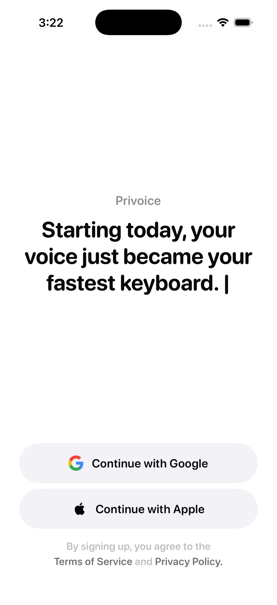 | 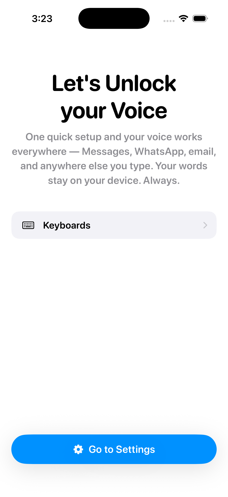 | 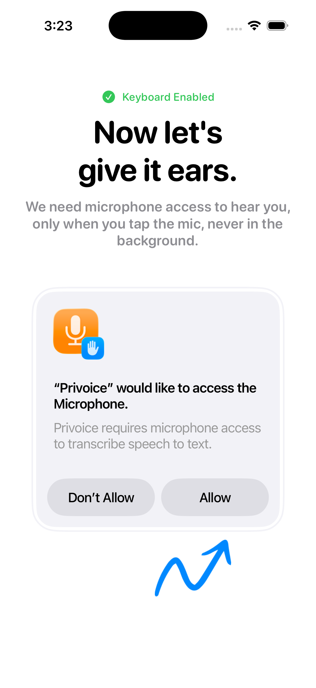 |

| 4. All set | 5. Activate voice | 6. Try voice |
|---|---|---|
| 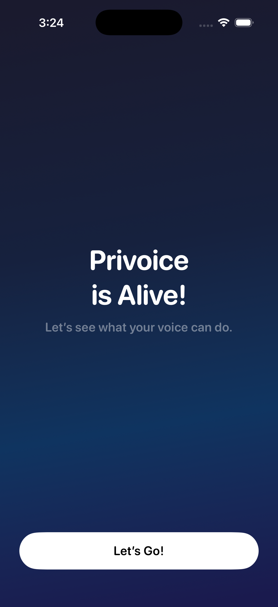 | 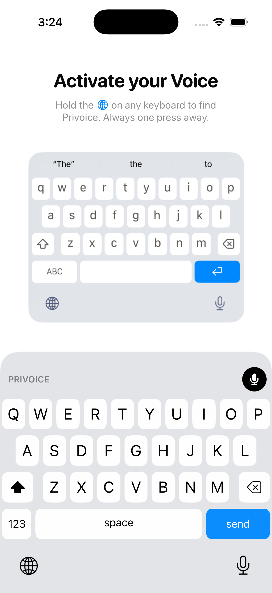 | 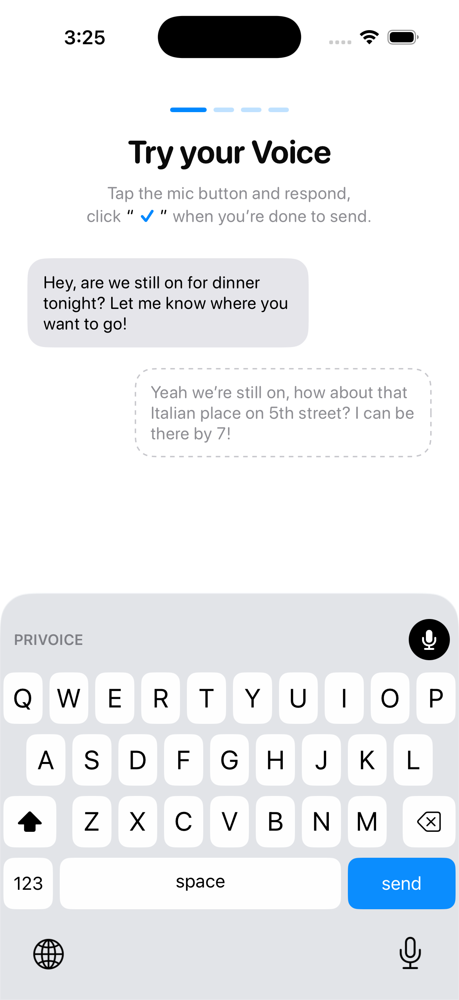 |

### Main app

| History | Notes | Snippets |
|---|---|---|
| 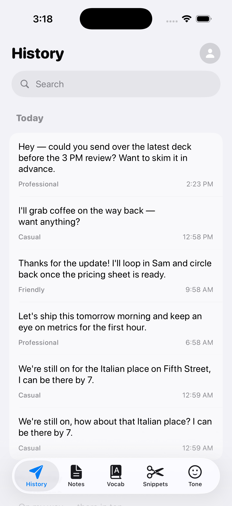 | 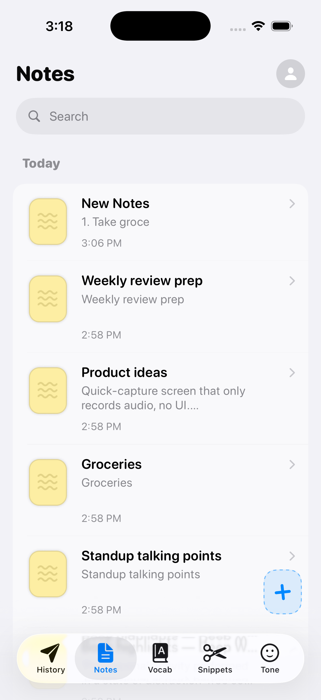 | 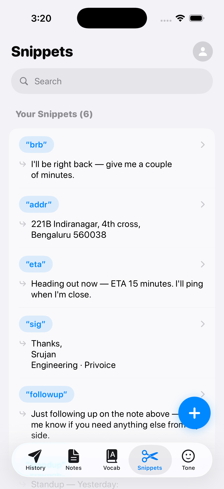 |

| Vocab | Tone | Note detail |
|---|---|---|
| 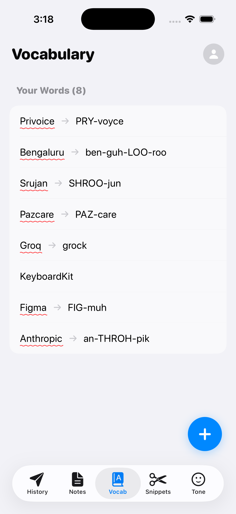 | 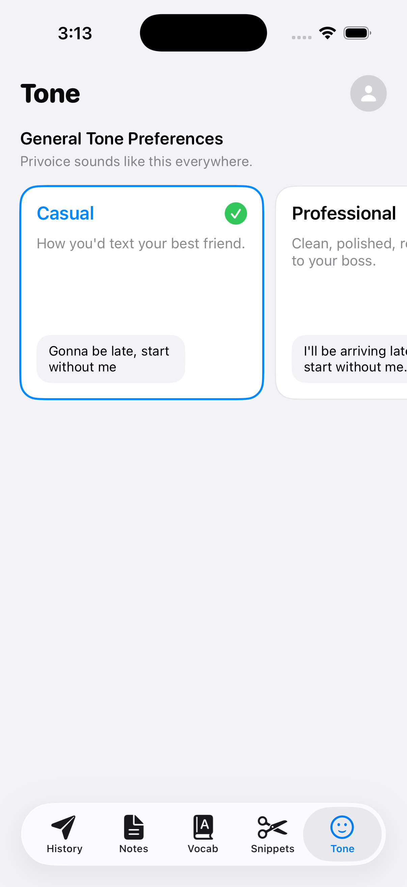 | 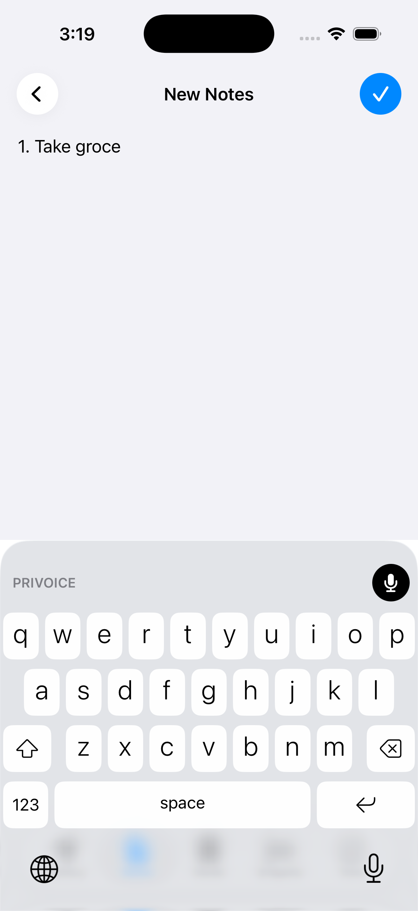 |

| Add snippet | Add vocab | |
|---|---|---|
| 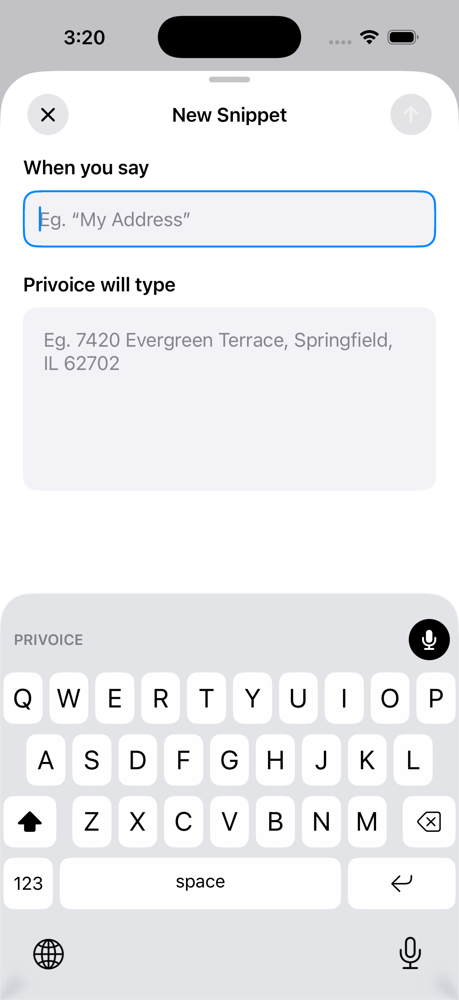 |  | |

### Keyboard

The full state machine of the Privoice keyboard, end-to-end:

| Idle | Listening | Transcribing |
|---|---|---|
| 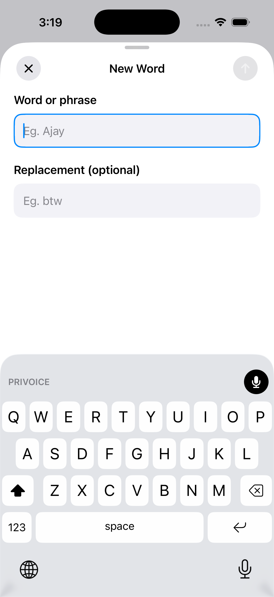 | 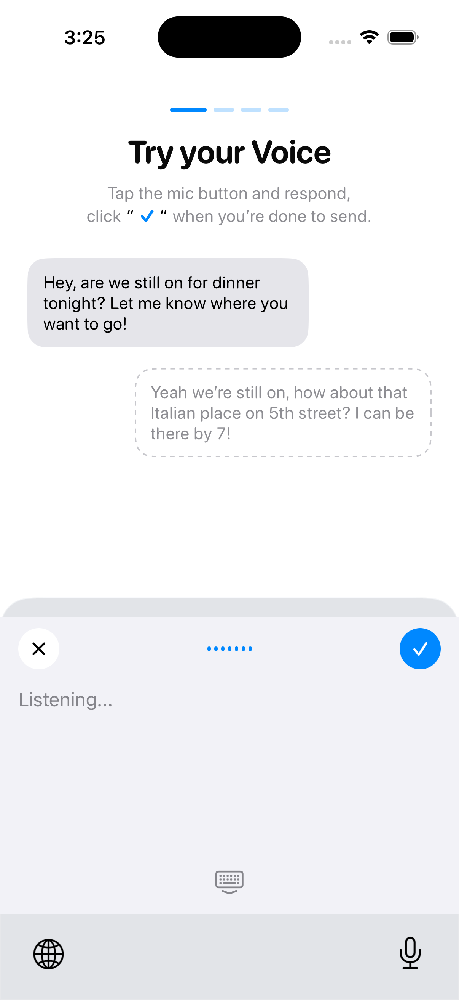 | 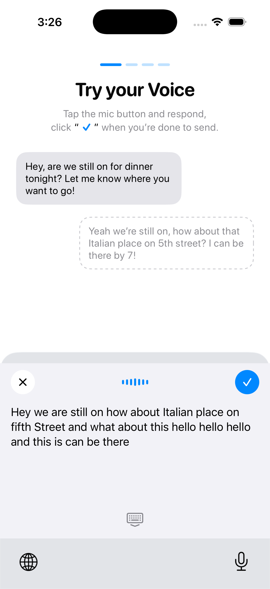 |

| Correction | Polished output |
|---|---|
| 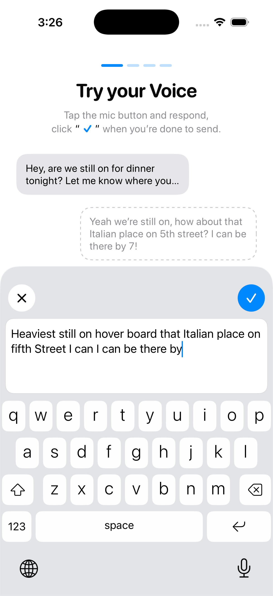 | 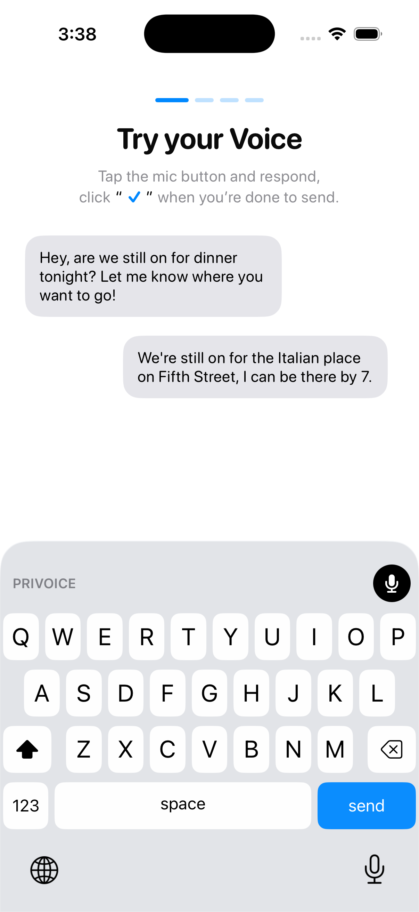 |

---

## How it works

```
┌──────────────────────┐         ┌──────────────────────┐         ┌────────────────┐
│ PrivoiceKeyboard     │  mic →  │ Speech.framework      │ text →  │ Backend /polish│
│ (system keyboard ext)│         │ on-device recognition │         │  Groq cascade  │
└─────────┬────────────┘         └──────────────────────┘         └────────┬───────┘
          │                                                                │
          │  polished text                                                 │
          ▼                                                                │
   insert into host app's text field   ◀─────────────────────────────────  ┘
```

The companion app handles auth, manages tone settings, snippets, and personal vocab, and syncs everything across devices through the backend's last-write-wins sync API.

---

## Repo layout

```
privoice/
├── ios/Privoice/
│   ├── Privoice/              # main app target (SwiftUI)
│   │   ├── App/               # PrivoiceApp, RootView, AppState
│   │   ├── Auth/              # email + Google sign-in
│   │   ├── Onboarding/        # 6-step flow (welcome → try voice)
│   │   ├── Main/              # History, Notes, Snippets, Vocab, Tone tabs
│   │   └── Settings/
│   ├── PrivoiceKeyboard/      # keyboard extension target
│   │   ├── KeyboardViewController.swift
│   │   ├── Speech/            # SpeechController, TranscriptBuffer, AudioLevelProvider
│   │   ├── UI/                # MicButton, WaveformView, TranscriptPreview
│   │   ├── Permissions/
│   │   └── State/
│   └── PrivoiceCore/          # shared SPM package
│       └── Sources/PrivoiceCore/
│           ├── API/           # APIClient, AuthAPI, SyncAPI, PolishAPI
│           ├── Database/      # GRDB schema + DAOs
│           ├── Models/        # Note, Snippet, VocabEntry, Tone, Message, User
│           ├── Sync/          # SyncCoordinator (LWW)
│           └── Storage/       # App Group shared storage
└── backend/
    ├── src/
    │   ├── routes/            # auth, me, sync, polish, health
    │   ├── services/          # Groq cascade, JWT, sync merge
    │   ├── models/            # Mongoose schemas
    │   ├── schemas/           # Zod request validators
    │   └── middleware/
    ├── package.json
    └── README.md              # backend-specific docs (endpoints, env, deploy)
```

---

## Getting started

### Backend

```bash
cd backend
npm install
cp .env.example .env
# fill in MONGODB_URI, GROQ_API_KEY, JWT_ACCESS_SECRET, JWT_REFRESH_SECRET
npm run dev
```

Server listens on `http://localhost:3000`. See [`backend/README.md`](backend/README.md) for the full endpoint reference, error codes, and sync model.

### iOS

Open `ios/Privoice/Privoice.xcodeproj` in Xcode 15+ and run the `Privoice` scheme on a physical device or simulator (iOS 17+).

The keyboard extension (`PrivoiceKeyboard`) is embedded in the main app. After installing, the user enables it from **Settings → General → Keyboard → Keyboards → Add New Keyboard → Privoice**, then grants "Allow Full Access" so the extension can talk to the backend. The onboarding flow walks through this.

Both targets share a Swift package (`PrivoiceCore`) and an App Group container so the keyboard can read the user's snippets, vocab, and tone settings without its own login.

---

## Tech stack

- **iOS:** SwiftUI, KeyboardKit 10.4.1, Speech.framework, GRDB, Google Sign-In SDK
- **Backend:** Node 20+, Express, MongoDB (Mongoose), Groq SDK, Zod, Pino, JWT (HS256)
- **Sync model:** client-authored timestamps + UUID `clientId` per record, last-write-wins, soft-delete tombstones

## Future Improvements

- **Sign in with Apple.** The "Continue with Apple" button is already in the welcome screen's layout but currently a no-op — wiring it up requires a paid Apple Developer account (the *Sign in with Apple* capability isn't available on the free personal team), so it's deferred until enrollment. The backend's `authService.googleLogin` already establishes the find-or-create-by-email pattern an `/auth/apple` route will reuse; the iOS side just needs `ASAuthorizationAppleIDProvider` + identity-token verification against Apple's JWKS on the server.
- **Push-to-talk hardware shortcut.** Today the user has to swap to the Privoice keyboard and tap mic. A Shortcuts/Action-Button hook that opens the most recent textfield + auto-starts listening would cut the activation friction.